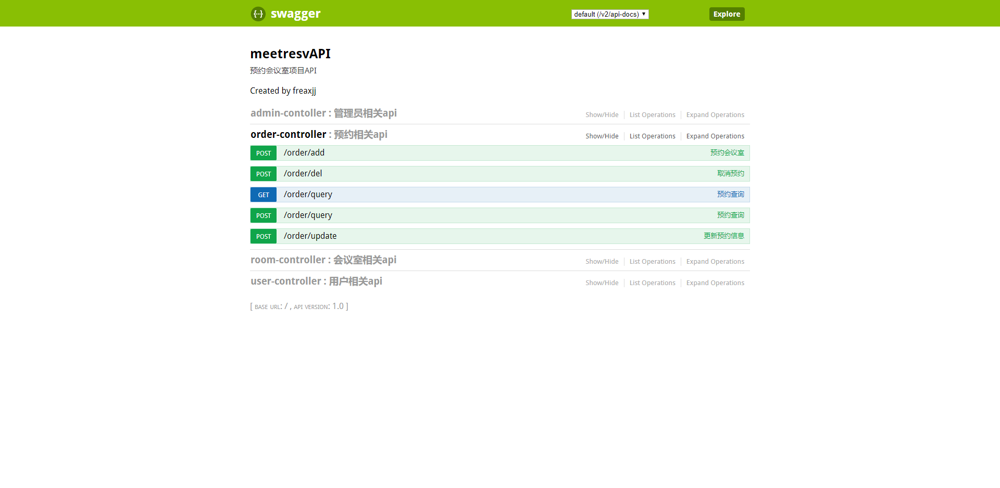
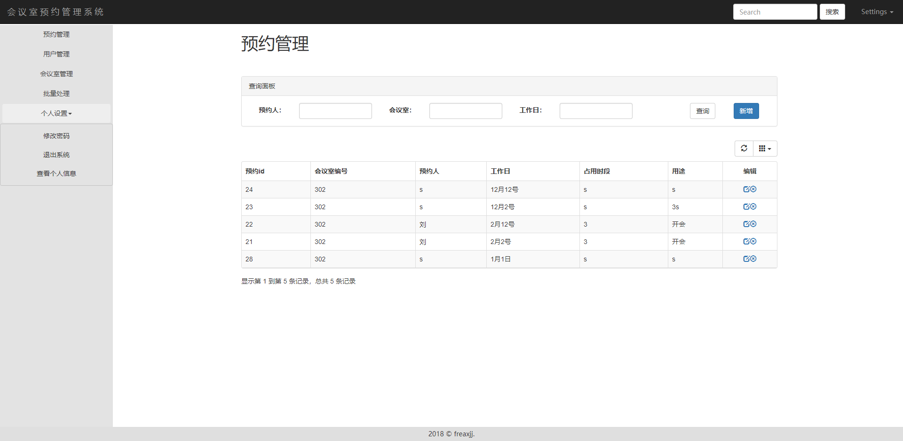

# 会议室预约管理系统

## 开发环境

JDK1.8、Maven、Mysql、IntelliJ IDEA、SpringBoot2.1.0、redis-2.1.2

## 启动说明

- 启动前 请配置 application.yml 中相关redis、mysql相关地址，建议在Linux下安装使用。

- 数据库脚本create.sql位于根目录，启动前请自行导入。

- 配置完成，运行MeetresvApplication中的main方法，访问 http://localhost:8084/swagger-ui.html 进行API测试。

- 本测试案例适用于生产环境，大家根据所需自行调整。

## 测试入口

http://localhost:8084/swagger-ui.html



## 项目截图




#### 项目介绍

SpringBoot开发的会议室预约管理系统，项目案例已在使用中。包括对接微信小程序的API和后端的管理系统。


## 应用场景

可以在企业内部对会议室等资源的预约进行管理。

#### 优化思路

- 由于项目复杂度不高，因此管理平台和API没有拆分，耦合性较高，灵活度不够。

- 应提高管理平台前端页面的复用性。

- 后期可以考虑增加功能，扩展至企业辅助应用。

#### 分层优化

- 前端优化：使用vue.js提高页面的交互性。
- 网络优化：使用nginx等分流。
- 应用服务优化：提高数据的实时性和并发访问。
- 应用扩展：对数据库操作优化，对应用进行分布式扩展。

## 涉及技术
- 如何搭建SpringBoot微服务
- REST的API接口，可对接小程序等。
- 对用户的企业账号进行验证，使用redis存储用户token。

#### 代码结构：
```
             

```

## 可供参考

[Spring Boot开发]( "Spring Boot开发")

## 欢迎关注


